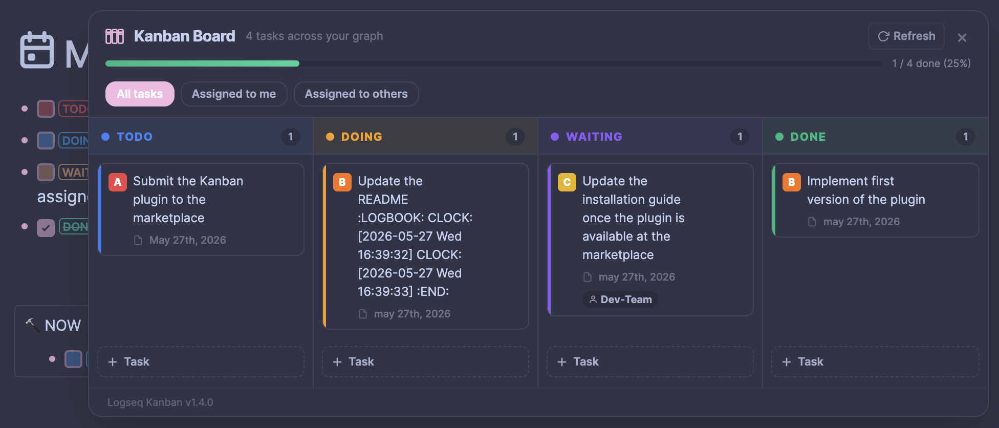

# Logseq Kanban Task Board

A floating kanban panel that shows all your tasks across four columns:

- TODO
- DOING
- WAITING
- DONE

Click any card to instantly navigate to the original Logseq block where the task was created. Use drag-and-drop or the context menu to seamlessly update a task’s status or priority.

## Screenshot

## Installation

1. Unzip the archive.
2. In Logseq: **Settings → Plugins → enable Developer mode**.
3. Click **Load unpacked plugin** and select the `logseq-kanban-task` folder.

## Usage

- Click the **kanban icon** in the Logseq toolbar to open/close the board.
- Click the **Refresh** button to reload tasks from your graph.
- Click any **task card** to navigate to that block and close the panel.
- Click anywhere **outside** the panel to close it.
- Use drag-and-drop or context-menu to update a task’s status or priority.

## How tasks are found

The plugin queries all blocks in your graph that have a `TODO`, `DOING`, `DONE`, or `WAITING` marker and groups them by state. The query uses Logseq’s built-in Datascript API - no external dependencies, no file system access.

## Notes

- Only explicit Logseq task markers are matched (not plain text).
- Page references (`[[PageName]]`) in task text are unwrapped for readability.
- Tasks longer than 120 characters are truncated on the card; the full text is visible when you navigate to the block.
